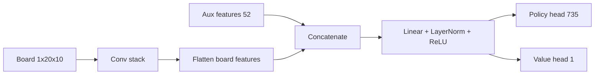

# Model Fusion: Current vs Proposed (Why They Are Different)

This document explains the difference between:

- The **current** Tetris model fusion
- A **proposed gated fusion** model

The confusion is understandable because both are "board + aux -> shared trunk -> policy/value heads".  
The key difference is **how strongly aux context can modulate board features**.

## 1) Current Model (What You Have Today)

Source: `tetris_mcts/ml/network.py`



Equivalent expression:

```text
board_h = f_conv(board)
z = ReLU(LN(Wb * board_h + Wa * aux + b))
policy = Wp * z + bp
value  = Wv * z + bv
```

### Important property

There is only one main fusion point (the first shared FC).  
So board/aux interactions are relatively shallow.

---

## 2) Proposed Gated Fusion (What "Better Fusion" Means)

```mermaid
flowchart LR
    B[Board 1x20x10] --> C[Board tower]
    C --> BH[board_h]

    A[Aux features 52] --> M[Aux MLP]
    M --> AH[aux_h]
    AH --> G[sigmoid gate]
    AH --> A2[Aux projection]

    BH --> MUL[board_h * (1 + gate)]
    G --> MUL
    MUL --> ADD[+]
    A2 --> ADD

    ADD --> F0[LayerNorm + ReLU]
    F0 --> RB[Residual fusion block]
    RB --> P[Policy head 735]
    RB --> V[Value head 1]
```

Equivalent expression:

```text
board_h = f_board(board)
aux_h   = f_aux(aux)
gate    = sigmoid(Wg * aux_h)

fused = LN(board_h * (1 + gate) + Wa * aux_h)
fused = fused + MLP(fused)      # optional residual block

policy = Wp * fused + bp
value  = Wv * fused + bv
```

### Important property

Aux can **directly scale** board channels/features via the gate.  
That gives stronger context dependence (hold/queue can reshape what board patterns matter).

---

## 3) Why This Is Not "Essentially The Same"

| Aspect | Current concat+FC | Proposed gated fusion |
|---|---|---|
| Fusion depth | Mostly one layer | Multi-step fusion |
| Aux influence | Additive mix at concat/FC | Additive + multiplicative modulation |
| Context sensitivity | Weaker | Stronger |
| Expressiveness | Lower | Higher |
| Can mimic current model? | n/a | Yes (by learning near-zero gating and simple fusion) |

So the proposed model is a **strictly more expressive superset** of the current one.

---

## 4) Concrete Intuition Example

Two states with the **same board**, but different queue/hold:

- State A: queue supports a T-spin setup
- State B: queue does not support it

Current model can react, but only through one shared FC fusion step.  
Proposed model can explicitly "turn up/down" board features tied to T-slot patterns via gating, making the board encoding itself context-aware before heads.

---

## 5) Rust Split-Inference Compatibility

Your Rust path caches board embeddings (`tetris_core/src/nn.rs`), so a good design keeps:

1. A board-only tower that can be cached
2. Aux/fusion applied after cached board features

The proposed gated fusion can be structured this way, so it still fits your split-model inference strategy.

---

## 6) Minimal Upgrade Path

If you want a low-risk path:

1. Add `aux_mlp` and project aux before fusion.
2. Add gating (`board_h * (1 + gate)`).
3. Add one residual fusion block.
4. Keep heads and training targets unchanged initially.

This isolates architecture impact without changing RL target semantics.
