# AlphaTetris: Superhuman Tetris via MCTS

This repo implements a superhuman RL policy for Tetris, based on AlphaZero-style MCTS. A neural network guides a Monte Carlo Tree Search and is trained on the games it generates.

I had been really curious about the AlphaGo algorithm ever since I learned years ago about it beating the world champion in Go (I remember [Robert Miles's](https://www.youtube.com/watch?v=v9M2Ho9I9Qo) excellent video on the topic). The idea of applying it to my all-time favourite game Tetris kept coming back to me (I used to play a lot of Tetris when I was younger), so I finally decided to give it a go. It was quite fun and a nice challenge.

The Tetris environment, MCTS, and inference are in Rust. The training loop is in Python.

Model weights and the replay buffer from the final training run are available in this [Google Drive folder](https://drive.google.com/drive/folders/1odKR2165kinUOqJ2Pg70bHjkRy48ktZ7?usp=sharing).

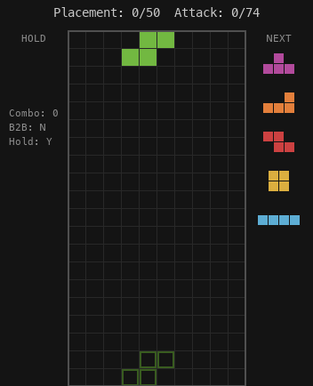

# Results

Below is the main optimization metric, "attack," over games and hours. Attack represents the number of lines sent to your opponent, using modern Tetris scoring (i.e. same as the [jstris](https://jstris.jezevec10.com) website).

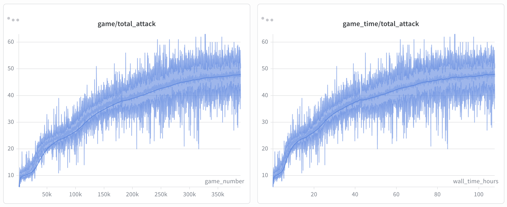

The training run took a little over 100h on Vast.ai and cost ~$50, on an AMD EPYC 7B13 64-core processor + 1x RTX 5060 Ti. I also implemented multi-machine game generation, so my M5 Pro Macbook joined in to give a ~25% increase in game throughput over some of the training. I believe training is still very CPU-bound, so simply scaling up to more CPUs would allow for much, much faster training.

Here is a visualization of the best game played by the agent over the last ~47K games (i.e. searching over the final state of the replay buffer), with an attack of 74 in 50 placements. Note that all training was on episodes with a maximum of 50 placements.

**Best Game**


Here is a randomly sampled game from the agent for a more representative sample of its play style. I included a visualization of the top 2 moves from the policy network (before MCTS) and the value network estimate (NN) in the top-right corner:

**Randomly Sampled Game**

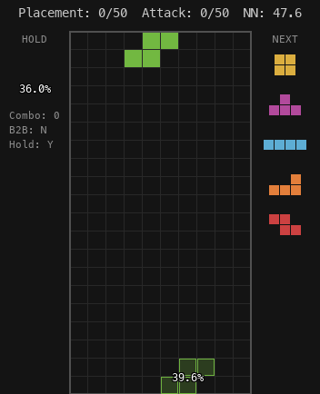

Instead of predicting win probability as in the original AlphaZero paper (AlphaZero is the successor to AlphaGo, sometimes I reference one or the other), we predict the cumulative attack over the remainder of the episode at each state. When searching the tree, each node's Q value becomes the cumulative attack up to that point plus the value network's estimate of the remaining attack over the episode. I apply min-max normalization to bring Q values into [0, 1] so they do not overtake the policy exploration term in magnitude.

Since Tetris is stochastic, unlike Go or Chess, I add chance nodes (over possible next pieces in the queue) to the tree and randomly visit one when descending. The Q value thus becomes an estimate of the expected attack over possible future queues.

Here are some metrics related to the play style of the agent and how they evolved over training:

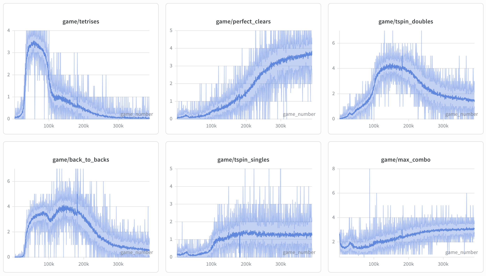

*FYI: I had to restart the run midway through training, which is why all the plots have a point of slight discontinuity.*

You can see how the model early on explores into doing 4-line clears (tetrises), and later learns to exploit perfect clears and t-spins. This is partly because I initially add a penalty to the value estimates for the number of "overhang" cells (which I define as any cell with a filled cell above it in the same column). As a general first heuristic, board states with more holes or overhang tend to have fewer attack actions available. I slowly ramp this penalty down over the first 50K games. Without it, it is possible we would not see the big tetris spike and the policy could have explored into perfect clears and t-spins earlier. I did find that early training had far higher average attack when including the overhang penalty, but maybe it could be ramped down a lot earlier for faster learning.

Here are some metrics related to loss and prediction accuracy:

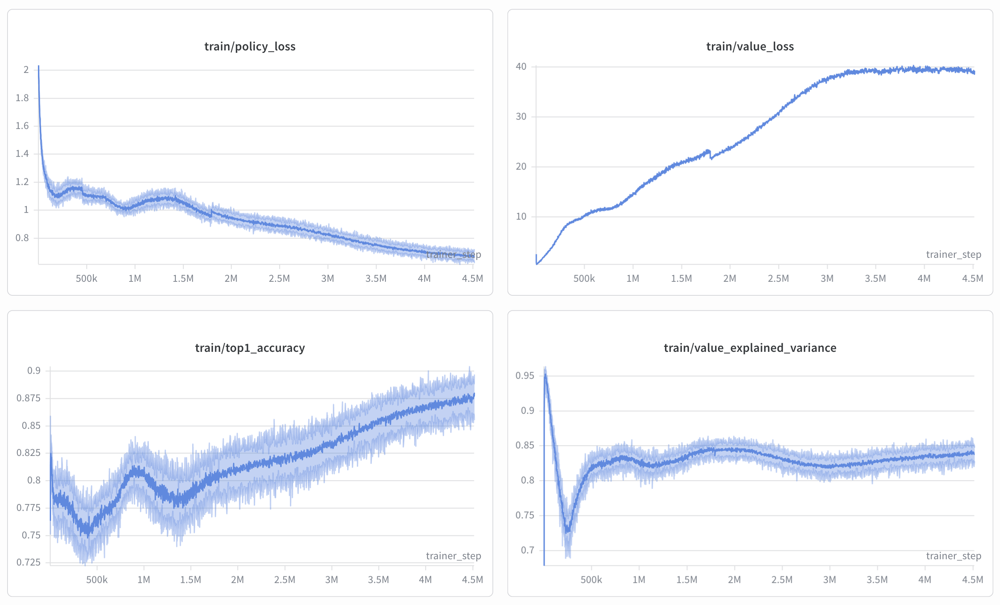

Definitely not converged on any of the metrics, so there should still be gains to be had from continuing training.

You can see how value loss rises over training as the cumulative attack values of the trajectories increase, leading to larger error magnitudes. This does not necessarily mean the value head is getting less accurate, as the regression problem is changing to have larger magnitude targets. I would look at the explained variance of the value predictions (lower right) rather than the raw loss for a sense of how well the model is doing.

Top-1 accuracy (lower left) refers to the rate at which the highest-probability action from the policy network matches the highest-probability action from the posterior MCTS policy. I.e. the rate at which argmaxing the network policy would have yielded the same action as using the final MCTS policy.

Here is the distribution of attack over episodes for 100 games sampled by deterministic play from the posterior MCTS policy at 2000 simulations (same number of simulations as during training), compared against top humans:

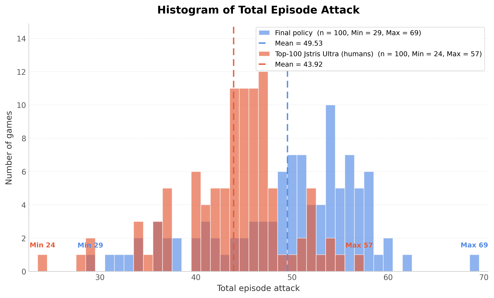

The policy beats top humans with a mean attack of 49.53, vs. a human mean of 43.92. To compare against top humans, I got Claude to scrape the [Jstris Ultra leaderboard](https://jstris.jezevec10.com/ultra). Jstris is a popular online competitive Tetris site with a relatively big player base. The objective of the [Ultra game mode](https://jstris.jezevec10.com/about#ultra) is to get as high an attack as possible over the course of 2 minutes. As far as I know, Jstris scoring and my scoring are identical, so the top leaderboard entries should represent strong human performance in terms of maximizing attack. As an example, here is [the link](https://jstris.jezevec10.com/replay/80665206) to the best human replay, with an attack of 57 in 50 placements.

That said, there are several ways in which this comparison is not quite fair:
* The human players are optimizing for speed and attack, while my policy only needs to optimize for attack.
* The human players are not trying to maximize attack within 50 placements, but within 2 minutes. 50 moves is not enough to be near the end of the episode for top humans, so they may still be optimizing for long-run attack at step 50, whereas AlphaTetris is explicitly optimized to maximize within 50 steps.
* There is a notable drop in performance going from the highest leaderboard entry to the 100th leaderboard entry. It would plausibly be more representative to scrape the top-1 human's personal top 100 games rather than the top 100 humans' best games. If you average the top 5 humans on the leaderboard you get a mean of 48.20, which the policy still beats, but more narrowly.
* That said, this comparison is also biased against my policy, in the sense that I only sampled 100 games and did not filter from a much larger pool of games, whereas the human trajectories are literally the highest scoring games on the entire platform. So that unfairly represents the average top-tier human performance, by applying further optimization pressure by subselecting to their best games. So the biases do go both ways.

Maybe there are better human-comparison sources out there. It would be interesting to see something like "human has 20 minutes to do N steps" and see what the human limit of placement efficiency is at long thinking times. For a quick comparison, I think this is reasonable.

# Limitations and things I would have loved to look into

I feel done-ish with this project, but there are many things I would have loved to explore:

- **Pareto frontier plots of network size vs. inference speed.**
  - Finding optimal architectures for the hardware. It might be better to have a larger network with a shallower search tree, or a deeper search tree with a smaller network. The idea is similar to the mock plot below from Claude: train models of different sizes, run them at various search depths, and plot each model-size family as a curve on avg attack vs. seconds per game. As a proxy you could even estimate this more cheaply by simply training them all on the replay buffer from my 100h training run, without having to do further training (although larger networks might be able to explore into more complex strategies that smaller networks would not be able to, so is not a perfectly faithful comparison).
  - 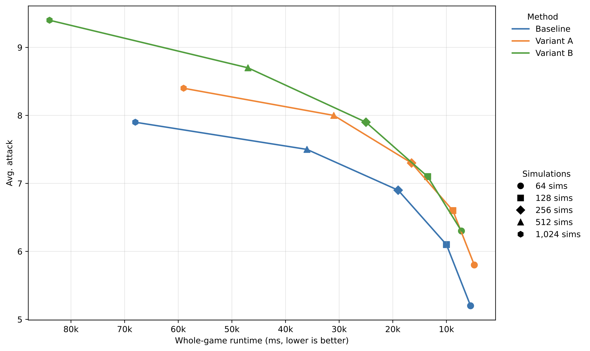
  - This is inspired by classic [reasoning-model scaling plots](https://openai.com/index/introducing-gpt-5/#:~:text=using%20the%20model.-,Faster%2C%20more%20efficient%20thinking,-GPT%E2%80%915%20gets):
  - 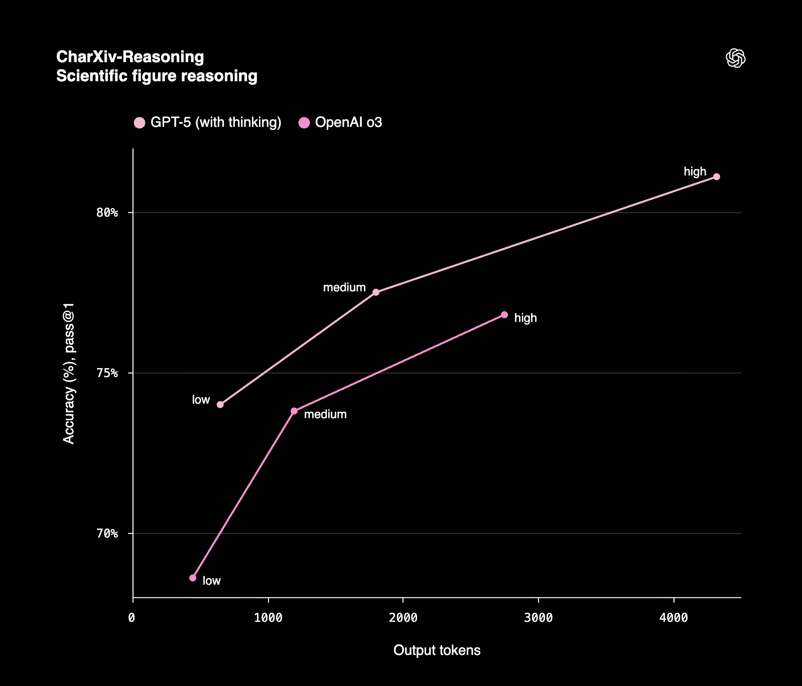
  - I did a proxy version of this in the repo [tetris-nn-autoresearch](https://github.com/hojmax/tetris-nn-autoresearch), where I used Codex in a loop to run experiments and improve my network architecture along the Pareto frontier of latency per prediction vs. final validation loss (assuming loss to be a somewhat representative proxy for final MCTS game performance). I got some nice finds, like EMA of the model weights improved generalization a lot, adding input coord channels to the CNN part of the network helped reduce policy loss, and increasing the size of the CNN trunk was beneficial.
  - 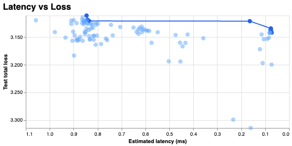
- **Finding the optimal tradeoff between policy loss and value loss.**
  - The relative weight between policy and value loss is a free parameter. The loss we optimize is:
    ```python
    total_loss = policy_loss + (value_loss_weight * value_loss)
    ```
    where policy loss is the cross-entropy between the network's policy and the MCTS policy, and value loss is the MSE between the network's value prediction and the true cumulative attack over the rest of the episode.
  - Currently I do two things. First, I take a rolling average over the last 2000 training steps of each loss and set `value_loss_weight` to their ratio so they equally contribute to the gradient (the MSE of the value estimate is on a very different scale from the cross-entropy loss). After they are scaled 1-1, I ended up further upweighting the policy loss by an arbitrary 10x so that the policy head contributes more to the gradient. But the question stands: what is the actual optimal tradeoff between the two?
  - One way of solving this is that if I knew the marginal gain of loss vs. attack for each head, I could balance the weight to optimize the tradeoff. I.e. if you had curves from policy loss to attack and from value loss to attack, then you could set the policy weight to the derivative of the policy curve at the current policy loss divided by the derivative of the value curve at the current value loss. The weighting would then be dynamic throughout training.
  - One idea for how you could go about estimating these curves could be to benchmark the model with various amounts of Gaussian noise added to the policy distribution (0 std, 0.1 std, 0.2 std, and so on), record the resulting average attack and the loss against the replay buffer, then fit a sigmoid through the points. Do a similar thing for the value head. Keep policy unchanged and add noise to the value head at increasing levels. For the value head you might want to use a randomly-initialized network instead of i.i.d. Gaussian noise, to also capture the bias of how the states which are over or under-evaluated are probably correlated, rather than just i.i.d. noise that mostly cancels out down the tree. Mock plot from Claude on this idea:
    - 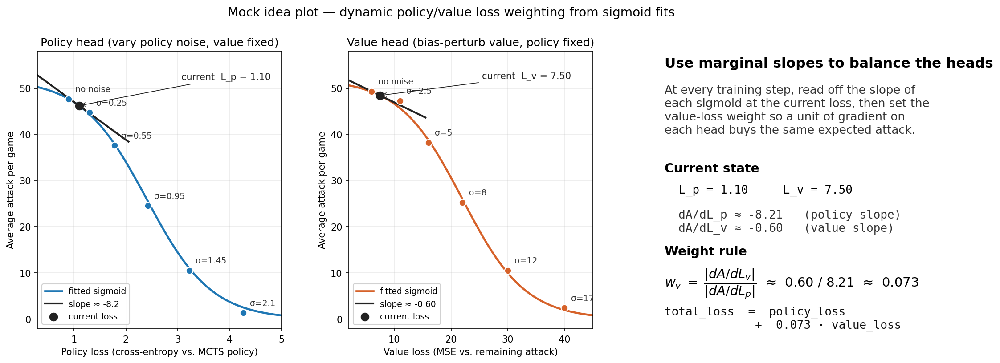
  - I did shortly look into this. It seemed that i.i.d. noise on the value head made very little difference until you cranked it up several times the cumulative attack magnitude, I think because moving down the tree averages it out in expectation, leaving the true value estimates roughly unchanged. This motivates modeling the bias as well. In the same experiment, noise to the policy was way more sensitive. Even tiny amounts of policy noise tanked performance. But this analysis was done on an early model, so I did not put that much weight in the results, and ended up just arbitrarily choosing to upweight policy loss 10x over value loss (on top of the magnitude balancing).
  - Of course keeping one head fixed and noising the other is a crude estimate and will not capture joint effects. The loss of the heads and their impact on final attack probably do not factorize independently, so you would ideally want a 2D function over (value loss, policy loss) and take derivatives. But it would be interesting to fit these curves on the current best model, and then try a full run from scratch with this idea, and see how learning speed compares to a comparison run with fixed loss weighting.
- **More inference optimization.**
  - I noticed that during search, many board states are exactly identical, but with different queue or hold pieces. This makes sense as around 38% of moves are hold swaps, and many board moves are the same when only the last piece of the queue changes (even if the last piece of the queue changes, most of the time your next move is probably unchanged).
  - So I got the idea to cache the board state. I.e. the optimization is to split the network into two parts, a residual CNN tower that produces a board-state embedding, and a smaller head that combines it with the queue and auxiliary features like combo, move number, etc. This led to a major speedup since most board states are cache hits. During training, around 95% of forward passes hit the cache. This also allows for a very deep ResNet tower on the board, since the cost is only paid on 5% of states. I do not think I have exploited the depth of the CNN tower enough though. The board-embedding network could probably be even deeper. Here is a quick diagram of the network architecture from Claude:
  - 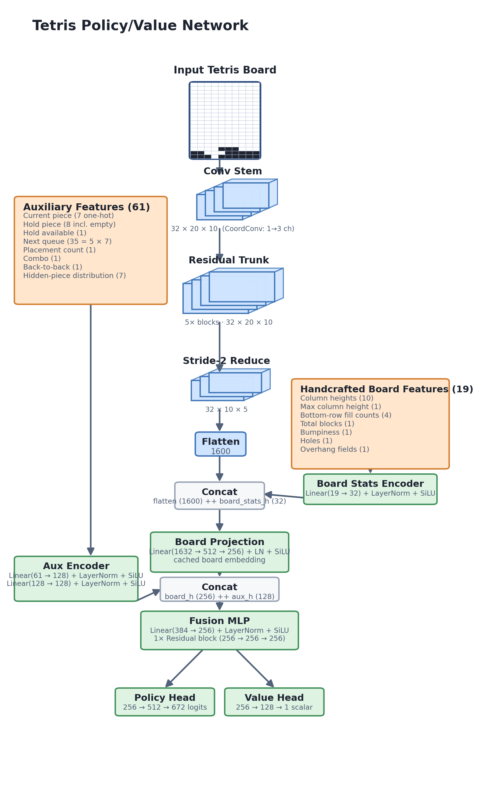
  - In terms of whether the current implementation could be used for real-time play, when doing 2000 sims on an Apple M5 Pro chip I get 971 ms / move. So a bit on the slower side. I have not looked into how performance changes as you drop the sim count. Plausibly fewer than 2000 sims is enough for good real-time superhuman play. And since we do tree reuse (when picking a move, extract the subtree for that action and continue search), the tree grows large throughout the game, so you could probably get away with fewer sims as the game progresses while still having a good posterior policy.
- **Some games are still kind of mid.** For an example of this, we can look at the lowest-attack game from the 100 games in the histogram earlier. I am guessing here, but I would think a perfect policy would not get 29-attack games. I would like to understand exactly what happens in these games. Very possibly this is mostly a question of increasing replay buffer size and training for longer. From the training curve, and given the amount of optimization I have put in, I am certain you could train a better policy.
  - 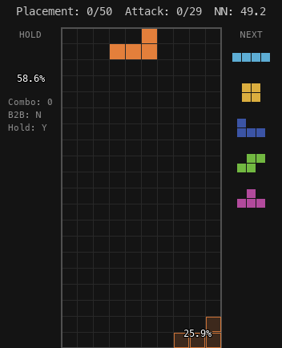
- **Better hyperparameter choices.** For some of the hyperparameters I just defaulted to what was described in the AlphaZero paper without any ablations, or chose arbitrary values based on what I thought would be reasonable. Examples of some parameters that would be interesting to look more into:
  - **Optimal search depth.** Essentially I would do a version of Leela Zero's (an open-source AlphaGo implementation) analysis of optimal search depth ([Optimal amount of visits per move #1416](https://github.com/leela-zero/leela-zero/issues/1416)). They run the final trained network at very large numbers of simulations and use this MCTS policy as the "ground truth" optimal policy. Then they compare intermediate posterior MCTS policies at search depths 1, 2, 3, ..., N against the final policy at N simulations and look at the KL divergence between the distributions. The average information gain is `(L(0) - L(N)) / N` where L(x) is the KL divergence between the final policy at N simulations and the intermediate policy at x simulations. Plotting this, they saw that around n=800 simulations is where you get the most bits of information per added search node, motivating that search depth over the n=3200 they were using at the time. I really liked the analysis as a very principled way of choosing search depth, and it would be quick to run with my model and then use that depth for future training runs. Screenshot of their analysis below.
  - 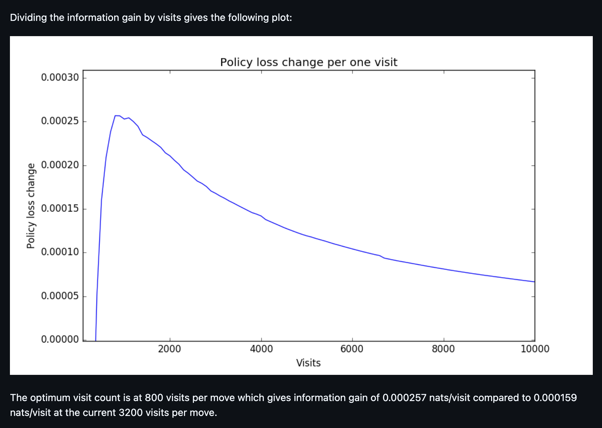
- **Adding a final low-LR deterministic training phase.**
  - The games in the replay buffer are generated with Dirichlet noise applied at the root node's network policy to encourage exploration during tree search (like in the original AlphaZero paper), and further stochasticity is introduced by 20% of chosen moves being sampled from the MCTS policy rather than argmaxed. For the earlier histogram of total attack of 100 games, I generated these games with both sources of noise turned off (no root noise, and only deterministic argmaxing of the MCTS policy). This gives a mean attack estimate of 49.53. At the end of training, the 100-game running average was 47.91, so 1.62 attack per game lower than fully deterministic. Simply turning off the noise and the stochastic sampling would be a very cheap way to generate higher-quality training data, at some risk of collapsing the policy, but at the end of training that is probably fine. I would expect adding this as a final training phase to improve performance.
  - Increasing the replay buffer size is another avenue for improving performance. I used a replay buffer of 3.25M states (~47K games), as this was the maximum size where all examples fit into 16GB of GPU memory. But it would probably be beneficial to use way larger replay buffers at the end of training. I did however do left-right data augmentation, since the optimal Tetris move is the same if you mirror the board and swap the queue pieces that cannot be rotated to be symmetric with another rotation (Z with S, L with J), so the effective number of training samples is twice the replay buffer size. Although that is probably not equivalent in information value to doubling the buffer, I would guess. Anyway, AlphaGo Zero saved [the last 500,000 games](https://discovery.ucl.ac.uk/id/eprint/10045895/1/agz_unformatted_nature.pdf), and with an estimated average Go game length of 200 moves, that is a replay buffer of around 100M states. They also did data augmentation with reflections and rotations. So they had a considerably larger replay buffer. Of course, Go is a much more complex game than Tetris, so it is not clear you need to scale that far.
- **Getting rid of the NN value weight schedule.**
  - Early on, I noticed that training wasn't progressing well. After some investigation, I tried doing the tree search with and without relying on the value head estimates, and I found that fully ignoring the value head estimates gave way higher attack on average than including them in the search.
  - I suspect the cause of this is that the value head is not just noisy early on but also biased. The states being over or under-estimated are probably correlated, since the CNN encodes similar states with similar representations. And this may be part of the reason why the value head estimates seemed to be actively harmful early on.
  - So to combat this, I ended up scheduling the value head, multiplying the NN value estimate by an alpha that ramps up from 0.01 to 1.0 over the first ~20K games. This however means that early in training, the cumulative past value dominates and the future value prediction is essentially ignored. This makes the policy very myopic, since it cannot easily forgo short-term attack for states expected to lead to higher cumulative attack later. Better understanding this failure mode and entirely removing the NN value estimate schedule or maybe ramping it up faster would be great for improving learning speed.
